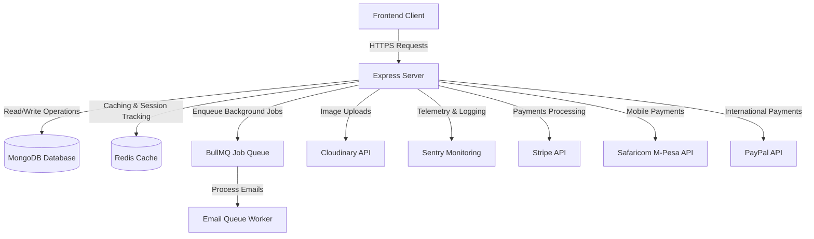
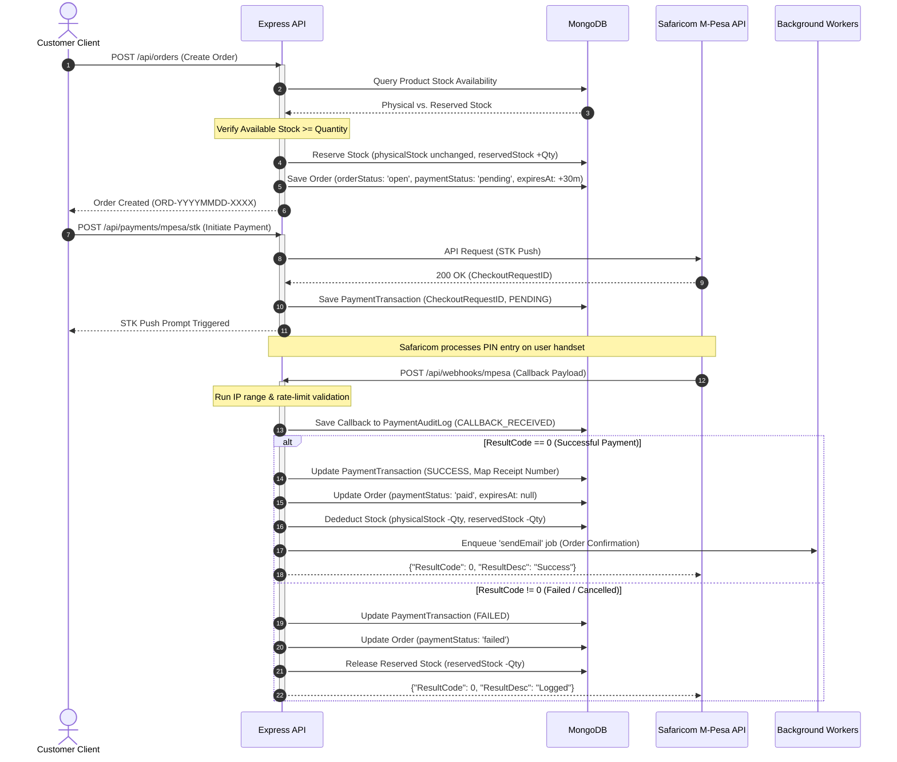

# Software Architecture Document

This document provides a comprehensive technical overview of the Rerendet Farm backend architecture, system integrations, lifecycle workflows, security structures, and architectural decisions.

---

## 1. System Services & Component Architecture

The application is built on a service-oriented Node.js/Express architecture utilizing multiple databases, caching layers, and external service providers to handle e-commerce, content management, and logistics operations.



### Core Technologies
*   **Application Server**: Node.js with Express.js.
*   **Primary Database**: MongoDB (object modeling via Mongoose).
*   **Caching & Session Storage**: Redis (used for active refresh token validation, rate-limiting counters, and session set matching).
*   **Queueing System**: BullMQ running on top of Redis for asynchronous operations (primarily email sending).
*   **Error Monitoring**: Sentry integration for exception logging, transaction tracing, and performance profiling.
*   **Asset Management**: Cloudinary for storing product images and store branding assets.

---

## 2. Environment Variables & Configuration

The application requires the following environment variables. The server validates critical keys at startup.

| Variable Name | Description | Required | Validation Action |
| :--- | :--- | :---: | :--- |
| `PORT` | Listening port for the Express application. Default: `5000`. | No | Used in `server.js` listener. |
| `NODE_ENV` | Environment mode (`development`, `production`, `test`). | No | Controls error verbosity, CORS rules, cookie secure flag, and rate limits. |
| `MONGO_URI` | MongoDB connection URI. | **Yes** | Warning logged if missing; connection attempted. |
| `JWT_SECRET` | Secret key used to sign Access Tokens. | **Yes** | Warning logged if missing; unsafe fallback used. |
| `JWT_REFRESH_SECRET` | Secret key used to sign Refresh Tokens. | **Yes** | Warning logged if missing; unsafe fallback used. |
| `FRONTEND_URL` | Base URL of the client application for CORS configuration. | **Yes** | Warning logged if missing. |
| `ENCRYPTION_KEY` | Hex-encoded key used to encrypt sensitive user data (phone, wallet info). | **Yes** | Warning logged; insecure fallback used if missing. |
| `SENTRY_DSN` | DSN for Sentry telemetry and reporting. | No | Sentry initialization skipped if missing. |
| `CRON_SECRET` | Token required to authenticate automated endpoints. | **Yes** | Secures `/api/cron/*` endpoints. |
| `GOOGLE_CLIENT_ID` | OAuth Client ID for Google Authentication. | No | Google authentication disabled if missing. |
| `CLOUDINARY_CLOUD_NAME` | Cloudinary account identifier. | No | Product image uploads fail if missing. |
| `CLOUDINARY_API_KEY` | Cloudinary API Key. | No | Verified during health checks. |
| `CLOUDINARY_API_SECRET`| Cloudinary API Secret. | No | Verified during health checks. |

---

## 3. Core Base Paths & Routing Map

The application routes are structured under `/api` and delegated as follows:

```
[Server Root]
  ├── /api/auth             --> authRoutes.js (Customer/Admin Auth & Session Control)
  ├── /api/products         --> productRoutes.js (Catalog, Stock Management, Uploads)
  ├── /api/orders           --> orderRoutes.js (E-commerce Operations & Lifecycle)
  ├── /api/customer         --> customerRoutes.js (Store Credit, Loyalty, Prompts)
  ├── /api/admin/reports    --> adminReportingRoutes.js (Analytics, Retention, Finance)
  ├── /api/admin/controls   --> adminControlsRoutes.js (Operational Switches)
  ├── /api/admin/alerts     --> adminAlertRoutes.js (Incident Reporting & Alerts)
  ├── /api/admin/sessions   --> adminSessionRoutes.js (Session Revocation)
  ├── /api/admin/audit-log  --> adminAuditRoutes.js (Immutable Admin Activity logs)
  ├── /api/admin            --> adminRoutes.js (Entity management, manual overrides)
  ├── /api/settings         --> settingsRoutes.js (Global config, maintenance magic link)
  ├── /api/cron             --> cronRoutes.js (Automated jobs)
  ├── /api/public           --> publicRoutes.js (Unauthenticated blog/product info)
  ├── /api/reviews          --> reviewRoutes.js (Product ratings & customer reviews)
  ├── /api/promotions       --> adRoutes.js (Campaign placements & impressions)
  ├── /api/blogs            --> blogRoutes.js (Content management)
  ├── /api/subscribers      --> subscriberRoutes.js (Newsletter subscriptions)
  ├── /api/marketing        --> marketingRoutes.js (Promotions & newsletter campaigns)
  ├── /api/cart             --> cartRoutes.js (Persistent cart state)
  ├── /api/dashboard        --> dashboardRoutes.js (Reporting graphs)
  ├── /api/webhooks         --> webhookRoutes.js (Asynchronous payment notifications)
  ├── /api/delivery-rates   --> Global delivery rates config fetched from Settings
  └── /api/health           --> Dynamic multi-service dependency health ping
```

---

## 4. End-to-End Order Flow Lifecycle

The order processing lifecycle is designed to be resilient against network failures, payment timeouts, and inventory race conditions.



### Steps Description
1.  **Creation & Inventory Check**: The client submits items to `/api/orders`. The system looks up physical stock vs. reserved stock. Available stock is calculated as `physicalStock - reservedStock`.
2.  **Stock Reservation**: If stock is available, the system increments `inventory.reservedStock` by the purchased quantity, protecting the stock from concurrent checkouts. The order is stored with a TTL (expires in 30 minutes if unpaid).
3.  **Payment Initiation**: For M-Pesa, the STK Push is dispatched. The response returns a `CheckoutRequestID` stored in the transaction collection as an idempotency key.
4.  **Handshake / Callback**:
    *   Safaricom hits `/api/webhooks/mpesa`.
    *   The route verifies the request source IP and checks for duplicate transaction IDs.
    *   An entry is logged into the immutable `PaymentAuditLog`.
5.  **Reconciliation / Processing**:
    *   **Success**: The order status updates. Reserved stock is cleared, and physical stock is decreased. An email notification is enqueued via BullMQ.
    *   **Failure / Expiry**: If the payment fails or the 30-minute window closes, the background job releases reserved stock (`reservedStock` decreases) and marks the order cancelled/expired.

---

## 5. Security & Authentication Flow Architectures

The backend implements security mechanisms protecting customer and admin endpoints.

### Customer Registration & Verification
1.  **Signup**: Post parameters sent to `/api/auth/customer/register`.
2.  **Password Security**: Password complexity is evaluated using `zxcvbn`. A lookup is performed against the *HaveIBeenPwned* (HIBP) API using k-Anonymity (sending the first 5 characters of the SHA-1 hashed password) to ensure the password is not compromised.
3.  **Verification**: The system generates a numeric 6-digit verification code stored with a 10-minute expiry. A verification email is dispatched.
4.  **Database Security**: User passwords are encrypted using `bcryptjs` with a cost factor of `14`. Sensitive details (phone numbers and M-Pesa wallets) are encrypted symmetrically (`AES-256-CBC`) via helper methods (`encrypt`/`decrypt`) prior to persistence.

### Administrator Multi-Factor Authentication
Admin accounts follow a strict login pattern to mitigate credential stuffing and session hijacking:
1.  **Primary Authentication**: Admin submits credentials to `/api/auth/admin/login`.
2.  **Dynamic 2FA Routing**:
    *   If credentials match, the server generates a 6-digit TOTP validation token.
    *   If the admin has Authenticator App (TOTP) enabled, they must verify via `/api/auth/2fa/verify` or backup codes.
    *   If not, a security code is emailed.
3.  **Session Generation**: Upon successful 2FA, an access token and a refresh token are generated.

### Emergency Maintenance Mode & "Super-Gate" Magic Link
When the system is placed in maintenance mode (`Settings.maintenance.enabled = true`), standard routes are blocked by `maintenanceMiddleware.js`.
To allow admins access to troubleshoot the system in production, a dynamic "Super-Gate" is available:
1.  **Rotation (Cron)**: An automated daily cron job (`/api/cron/magic-link-rotation` protected by `CRON_SECRET`) rotates a cryptographically secure 32-byte token.
2.  **Dispatch**: The raw token is sent to the super-admin email and the hashed token is saved in the `Settings` collection.
3.  **Entrance**: Accessing `/api/settings/super-gate/<token>` sets a secure bypass cookie.
4.  **Bypass**: The maintenance middleware inspects the cookie and bypasses restrictions, allowing the admin to access the dashboard during outages.

---

## 6. External APIs & Service Integrations

The system integrates with the following external providers:

1.  **Safaricom M-Pesa API (Daraja)**:
    *   Used for STK Push (`Lipa Na M-Pesa Online`) and query validation.
    *   Callback URL: `/api/webhooks/mpesa`. Requires IP verification to match Safaricom's public payment gateway IPs.
2.  **Stripe API**:
    *   International credit card payment processing.
    *   Webhook URL: `/api/webhooks/stripe`. Uses signature checking via `Stripe.webhooks.constructEvent` with the raw request body.
3.  **PayPal API**:
    *   Order creation and capture processing.
4.  **Google OAuth 2.0**:
    *   Single-sign-on verification. Token signature validated using `google-auth-library`.
5.  **Cloudinary API**:
    *   Secure storage and optimization of catalog images.
6.  **Sentry Node SDK**:
    *   Performance profiling and runtime error tracing.

---

## 7. Architectural Decisions (ADR)

### ADR 001: Immutable Event Logging
*   **Context**: Security and financial audits require reliable tracking of payment updates and admin changes.
*   **Decision**: The collections `PaymentAuditLog` and `ActivityLog` enforce strict database-level immutability. Pre-save hooks block updates and deletion queries (`deleteOne`, `deleteMany`, `updateOne`, `findOneAndUpdate`, etc.) at the database driver level.
*   **Rationale**: Prevents compromised admin accounts from erasing logs to cover up illicit actions.

### ADR 002: Session Fingerprinting and Concurrency Caps
*   **Context**: High privilege admin credentials must be protected against session hijacking.
*   **Decision**:
    *   **Fingerprinting**: Access and Refresh tokens encode a fingerprint hash (`fpt`) derived from the client IP and User-Agent. During token validation, this hash is verified against the incoming request context.
    *   **Concurrent Limit**: Admin accounts are capped at 3 active sessions. Creating a fourth session revokes the oldest session in Redis and logs a database revocation event.
    *   **Geolocation Anomalies**: Logins from a different country trigger a critical admin alert and dispatch warning emails.

### ADR 003: Double-Lock Rate Limiting Strategy
*   **Context**: Denial of Service (DoS) and brute force attacks on authentication/checkout logic must be stopped early.
*   **Decision**:
    *   **Global Limiter**: Applied to all `/api/` endpoints (500 requests per 15 minutes).
    *   **Auth Limiter**: Applied to `/api/auth` endpoints (30 requests per 15 minutes in production, 1000 in dev).
    *   **Login Limiter**: Strict limit of 5 attempts per IP in 15 minutes for `/api/auth/*/login` and `/api/auth/*/verify-2fa`.
    *   **Checkout Limiter**: Applied to order creation to prevent carding attacks and inventory locking.
    *   **Incident Response**: Exceeding rate limits dispatches an alert (`securityAlerts.js`) to notify admins of potential attacks.
