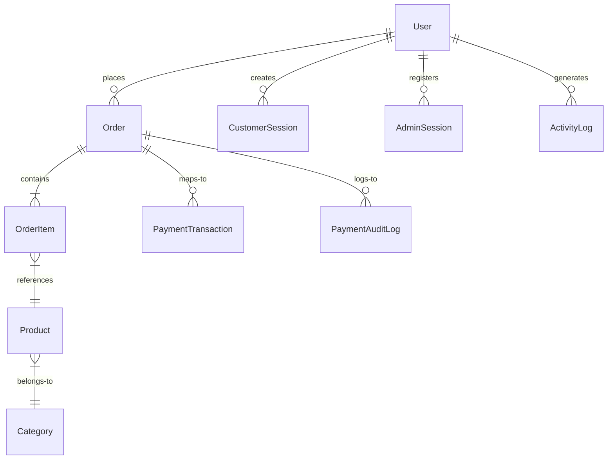

# Database Architecture and Schema Specifications

This document defines the data models, indexing strategies, virtual properties, mongoose pre/post hooks, collection relationships, and data flows within the MongoDB database of the Rerendet Farm platform.

---

## 1. Database Connections & Management
*   **Database Engine**: MongoDB.
*   **Object Data Modeling (ODM)**: Mongoose.
*   **Encryption**: Symmetrically encrypted fields (`phone`, `wallet.mpesaPhone`) are transformed at the driver level using pre-save setters and post-load getters via `cryptoUtils.js` (`AES-256-CBC`).

---

## 2. Entity-Relationship Model (ERD)

The core collections are related as follows:



---

## 3. Schema Definitions

### 3.1. User Schema (`users`)
Stores customer credentials, profiles, wallet details, shipping directories, and security states.

*   **Key Fields**:
    *   `firstName` / `lastName` (String, required).
    *   `email` (String, unique, lowercase, regex-validated).
    *   `phone` (String, encrypted setter, decrypted getter).
    *   `password` (String, selected false by default).
    *   `userType` / `role` (String, enums: `customer`, `admin`, `super-admin`, etc.).
    *   `isSuspended` (Boolean).
    *   `wallet.mpesaPhone` (String, encrypted).
    *   `cart` (Array of subdocuments referencing `Product` with quantity and size).
*   **Virtuals**:
    *   `isLocked`: Returns true if the account lock period (`lockUntil`) has not expired.
    *   `fullName`: Concatenates first and last name.
*   **Hooks**:
    *   `pre-save`: Hashes the password using `bcryptjs` with a cost factor of `14` if modified. Sets `passwordChangedAt` if updating an existing password.
*   **Indices**:
    *   `email`: Unique index.
    *   `role`: Standard index.

### 3.2. Order Schema (`orders`)
Maintains order state, financials, fulfillment details, and audit history.

*   **Key Fields**:
    *   `orderNumber` (String, unique).
    *   `user` (ObjectId, references `User`).
    *   `items` (Subdocument array referencing `Product`, with quantity, size, price, and item total).
    *   `shippingAddress` (Subdocument).
    *   `subtotal` / `shippingCost` / `tax` / `total` (Number).
    *   `orderStatus` (String, enum: `open`, `completed`, `cancelled`).
    *   `paymentStatus` (String, enum: `pending`, `paid`, `failed`, `refunded`).
    *   `fulfillmentStatus` (String, enum: `unfulfilled`, `packed`, `shipped`, `delivered`, `returned`).
    *   `roastStage` (String, enum: `roast_scheduled`, `roasting_in_progress`, etc.).
    *   `expiresAt` (Date, expires in 30 minutes unless payment is confirmed).
*   **Virtuals**:
    *   `status`: Backward compatibility helper mapping granular statuses to display states (`Cancelled`, `Returned`, `Delivered`, `Shipped`, `Processing`, `Confirmed`).
*   **Hooks**:
    *   `pre-save`: Generates a random alphanumeric `orderNumber` (e.g. `ORD-XXXXXX-XXXX`) and tracking number if new. Appends an initial `ORDER_CREATED` event log.
*   **Indices**:
    *   `createdAt`: -1 (for fast sorting).
    *   `paymentStatus`: 1, `createdAt`: -1 (compound index).
    *   `user`: 1 (user filter speed).
    *   `expiresAt`: TTL index set to expire documents at the designated timestamp.

### 3.3. Product Schema (`products`)
Houses catalog details, stock states, and categorization.

*   **Key Fields**:
    *   `name` / `description` (String, required).
    *   `sizes` (Array of size descriptions and associated prices).
    *   `categoryId` (ObjectId, references `Category`).
    *   `inventory.physicalStock` (Number).
    *   `inventory.reservedStock` (Number).
    *   `inventory.lowStockThreshold` (Number).
    *   `inStock` / `isActive` (Boolean).
    *   `seo.slug` (String, unique, sparse).
*   **Virtuals**:
    *   `availableStock`: Calculates `physicalStock - reservedStock`.
    *   `isLowStock`: True if `availableStock <= lowStockThreshold`.
    *   `category`: Normalizes the category name/slug.
*   **Hooks**:
    *   `pre-save`: Autogenerates a URL-safe SEO slug from the product name if missing or modified. Evaluates `inStock = availableStock > 0`.
*   **Indices**:
    *   `ProductTextIndex`: Compound text index weighting `name: 10`, `tags: 5`, `origin: 3`, `description: 1`, `flavorNotes: 1`.
    *   `categoryId`: 1, `isActive`: 1.
    *   `seo.slug`: 1.

### 3.4. Category Schema (`categories`)
Defines the product classification system and attribute schemas.

*   **Key Fields**:
    *   `name` / `slug` (String, unique).
    *   `attributeSchema` (Array of attribute definitions specifying keys, types, units, and options).
*   **Hooks**:
    *   `pre-save`: Sluggifies name.

### 3.5. Session Schemas (`customersessions` and `adminsessions`)
Tracks active sessions for concurrent session management and revoking access tokens.

*   **Key Fields**:
    *   `jti` (String, unique UUID).
    *   `userId` / `adminId` (ObjectId, references `User`).
    *   `ipAddress` / `deviceInfo` (String).
    *   `isRevoked` (Boolean).
    *   `expiresAt` (Date).
*   **Indices**:
    *   `expiresAt`: TTL index (`expireAfterSeconds: 0`) that automatically deletes expired session logs.

---

## 4. Ledger Immutability Architecture

For security and auditing compliance, two collections are write-only:

1.  **ActivityLog (`activitylogs`)**: Logs admin actions.
2.  **PaymentAuditLog (`paymentauditlogs`)**: Records payment callback webhooks and transaction state changes.

### Enforcement Hook
Both collections implement Mongoose pre-save and pre-query hooks to block updates and deletions:
```javascript
schema.pre('save', function (next) {
  if (!this.isNew) {
    return next(new Error('Security Restriction: Logs are strictly immutable.'));
  }
  next();
});

const blockMutations = (next) => {
  next(new Error('Security Restriction: Logs cannot be modified or deleted.'));
};
schema.pre('remove', blockMutations);
schema.pre('deleteOne', blockMutations);
schema.pre('deleteMany', blockMutations);
schema.pre('updateOne', blockMutations);
schema.pre('findOneAndUpdate', blockMutations);
```

---

## 5. Indexing Strategy Summary

| Collection | Target Fields | Index Type | Use Case |
| :--- | :--- | :--- | :--- |
| `products` | `name`, `tags`, `origin`, `description` | Text Index | Global Catalog Search |
| `products` | `seo.slug` | Unique, Sparse | SEO routing lookup |
| `orders` | `expiresAt` | TTL Index (30m) | Auto-expiring unpaid order bookings |
| `paymenttransactions` | `transactionId`, `provider` | Compound Unique | Prevents cross-provider ID collisions |
| `paymentauditlogs` | `event`, `createdAt` | Compound | Financial audit logs chronological query |
| `customersessions` | `expiresAt` | TTL Index (0s) | Revoking expired tokens |
| `adminsessions` | `expiresAt` | TTL Index (0s) | Revoking expired tokens |
| `users` | `email` | Unique | Login verification lookup |
