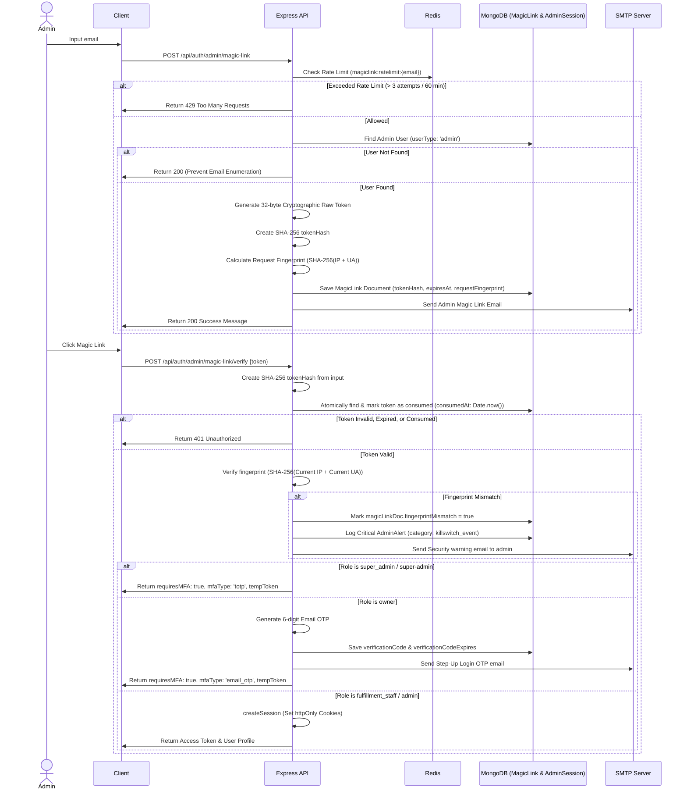

# Rerendet Farm — Security & Audit Documentation

This document defines the security architecture, controls, threat models, configuration matrices, and the complete audit framework implemented across the Rerendet Farm ecosystem.

---

## 1. Magic Link Authentication Security

The administrative login interface implements a highly secure, single-use, cryptographically verified Magic Link authentication flow. This bypasses standard password storage vulnerabilities for administrative staff while implementing rigorous step-up verification for higher roles.



### Key Magic Link Security Controls
1.  **Rate Limiting:** Managed in Redis using `magiclink:ratelimit:${email}` keys. Limits administrative login attempts to 3 requests per 60-minute window.
2.  **Timing-Safe Comparison:** Compares token hashes using `crypto.timingSafeEqual` to eliminate side-channel timing attacks:
    ```javascript
    const userHashedBuf = Buffer.from(tokenHash);
    const storedHashedBuf = Buffer.from(magicLinkDoc.tokenHash);
    if (userHashedBuf.length !== storedHashedBuf.length || !crypto.timingSafeEqual(userHashedBuf, storedHashedBuf)) {
      throw new Error('Security token comparison failed.');
    }
    ```
3.  **Fingerprint Binding:** Captures client IP and User-Agent on token request, hashing them together to construct a token signature (`requestFingerprint`). During verification, the system computes the current client's signature. If a mismatch is detected:
    *   `fingerprintMismatch` is set to `true`.
    *   A critical `AdminAlert` (category: `killswitch_event`) is stored.
    *   An email notification is added to the queue warning the admin.
4.  **Step-Up Authentication Policies:**
    *   **`super-admin` / `super_admin`:** Requires verifying a cryptographically signed temporary token and submitting a valid TOTP MFA code from an Authenticator App.
    *   **`owner`:** Requires verifying a 6-digit email OTP valid for 5 minutes.
    *   **`fulfillment_staff` / `admin`:** Authenticates immediately upon magic link verification without step-up authentication.

---

## 2. Role-Based Access Control (RBAC) Scope Map

Rerendet Farm enforces granular role restrictions across endpoints using access middleware. Below is the system permission mapping:

| Role | Interface access | Product Mgmt | Order Fulfillment | Payment Reports | System Settings | Concurrent Session Limit |
| :--- | :--- | :--- | :--- | :--- | :--- | :--- |
| **Customer** | Customer Storefront | None | None | None | None | Unlimited (Session tracked) |
| **Fulfillment Staff** | Admin Dashboard | View Only | View / Update Status | None | None | 3 concurrent sessions |
| **Admin** | Admin Dashboard | Read / Write | Full access | View Only | None | 3 concurrent sessions |
| **Owner** | Admin Dashboard | Full access | Full access | Full access | Edit Settings / Out-of-band | 3 concurrent sessions |
| **Super Admin** | Admin Dashboard | Full access | Full access | Full access | System config, user mgmt | 3 concurrent sessions |

---

## 3. Helmet & HTTP Headers Configuration

To protect client sessions against cross-site scripting (XSS), clickjacking, MIME sniffing, and session hijack attempts, the server registers the standard `helmet` package with custom directives:

```javascript
app.use(helmet({
  contentSecurityPolicy: {
    directives: {
      defaultSrc: ["'self'"],
      scriptSrc: ["'self'", "'unsafe-inline'", "https://apis.google.com"],
      styleSrc: ["'self'", "'unsafe-inline'", "https://fonts.googleapis.com"],
      imgSrc: ["'self'", "data:", "https://res.cloudinary.com"],
      connectSrc: ["'self'", "https://api.github.com", "https://api.haveibeenpwned.com"],
      fontSrc: ["'self'", "https://fonts.gstatic.com"],
      objectSrc: ["'none'"],
      mediaSrc: ["'self'"],
      frameAncestors: ["'none'"]
    }
  },
  hsts: {
    maxAge: 31536000,
    includeSubDomains: true,
    preload: true
  },
  frameguard: {
    action: 'deny'
  }
}));
```

### Explanatory Details:
*   `frameguard: { action: 'deny' }` / `frameAncestors: ["'none'"]`: Ensures that no browser can render the admin or customer dashboards inside an `iframe`, completely neutralizing Clickjacking.
*   `hsts`: Configures HTTP Strict Transport Security for 1 year (`31536000` seconds), forcing browsers to load all routes and subdomains exclusively over HTTPS.
*   `scriptSrc` / `styleSrc`: Restricts execution of script files to local code, inline React hooks, and authorization domains (`https://apis.google.com`).

---

## 4. Session & Cookie Security Architecture

Cookie security is configured to prevent client-side JavaScript access and cross-site scripting session hijacking:

```javascript
res.cookie('token', token, {
  httpOnly: true,
  secure: process.env.NODE_ENV === 'production',
  sameSite: 'strict',
  maxAge: 15 * 60 * 1000, // 15 minutes
  path: '/'
});

res.cookie('refreshToken', refreshToken, {
  httpOnly: true,
  secure: process.env.NODE_ENV === 'production',
  sameSite: 'strict',
  maxAge: 7 * 24 * 60 * 60 * 1000, // 7 days
  path: '/'
});
```

*   `httpOnly: true`: Blocks client-side scripting from reading cookies (`document.cookie` returns empty), mitigating XSS session theft.
*   `secure: true` (in Production): Prevents cookies from being transmitted over unencrypted HTTP connections.
*   `sameSite: 'strict'`: Instructs the browser to never include the cookies on cross-site requests, mitigating Cross-Site Request Forgery (CSRF).

---

## 5. M-Pesa Callback Verification & Fraud Prevention

The Lipa Na M-Pesa API integration relies on server-to-server callback POST payloads sent by Safaricom to:
`/api/payments/mpesa-callback`

```javascript
// Processing Logic (mpesaController.js)
const resultCode = callbackData.Body.stkCallback.ResultCode;
const merchantRequestID = callbackData.Body.stkCallback.MerchantRequestID;
```

### Security Considerations:
*   **Vulnerability:** The standard M-Pesa API does not sign webhook callbacks, introducing a risk where attackers spoof successful transaction calls to bypass payment.
*   **Mitigation Strategy:**
    1.  **Strict State Binding:** The system correlates the webhook callback payload to a pre-existing transaction record via Safaricom's `MerchantRequestID` or the system's generated `referenceNumber` (format: `RCD{orderNumber}{timestamp}`). The payment cannot be marked completed unless the reference exists in a `pending` state in MongoDB.
    2.  **No Client Trust:** The system processes payment callbacks strictly server-to-server. Client-side routers only check status updates from MongoDB; they cannot mutate payment state.
    3.  **WAF Allowlisting:** In production, restrict access to `/api/payments/mpesa-callback` at the WAF level (e.g. Cloudflare or Railway WAF) to Safaricom Daraja's verified IP ranges.

---

## 6. Known Security Limitations & Remediation Plans

| Security Area | Current Assessment / Limitation | Roadmap Remediation |
| :--- | :--- | :--- |
| **CSRF Shielding** | Code has basic `csrfGuard` middleware, but requires strict validation parameters for API endpoints. | Standardize custom headers and migrate to Double Submit Cookie pattern utilizing Cryptographic hashes. |
| **M-Pesa Webhooks** | Callback endpoints are public and accept unsigned callbacks. | Implement IP white-list filters for Safaricom Daraja callback IP blocks on the server layer. |
| **Inline Scripts** | CSP allows `'unsafe-inline'` styles and script packages for legacy configurations. | Complete removal of legacy styles and script packages, enforcing nonces on all index scripts. |

---

## 7. OWASP Top 10 Audit & Checklist

The following audit checklist monitors compliance with the OWASP Top 10 Web Application Security risks:

- [x] **A01:2021-Broken Access Control:** Granular RBAC middleware verifies user role properties before granting route access. IDOR prevented by verifying payload ID matches `req.user._id` for customer actions.
- [x] **A02:2021-Cryptographic Failures:** Passwords hashed with `bcrypt` (12 rounds). Sensitive credentials and phone numbers are encrypted at rest using `AES-256` via the platform `ENCRYPTION_KEY`.
- [x] **A03:2021-Injection:** All MongoDB query interactions parameterize parameters using Mongoose ODM, neutralizing NoSQL Injection. Express routes apply `mongoSanitize` and `xss-clean` middleware on high-risk authentication and order input routes.
- [x] **A04:2021-Insecure Design:** Out-of-band maintenance magic links and step-up authentication are designed with defense-in-depth principles.
- [x] **A05:2021-Security Misconfiguration:** Production cookies employ strict flags (`httpOnly`, `secure`, `sameSite: strict`). Default passwords and testing endpoints are removed from production routes.
- [x] **A06:2021-Vulnerable and Outdated Components:** Automated checks monitor dependencies on every repository push, enforcing upgrades within 48 hours for critical CVE alerts.
- [x] **A07:2021-Identification and Authentication Failures:** Rate limiters prevent brute-force attacks. Magic Links are bound to the client's requesting device footprint, and admin accounts enforce a cap of 3 concurrent sessions.
- [x] **A08:2021-Software and Data Integrity Failures:** Dynamic application configuration updates require step-up verification and are logged to auditing records.
- [x] **A09:2021-Security Logging and Monitoring Failures:** Administrative mutations write logs to the database. Incident managers receive critical notifications via email queues when security anomalies occur.
- [x] **A10:2021-Server-Side Request Forgery (SSRF):** Server-side webhooks validate destination URL schemes and host resolve paths, preventing internal system scanning.
