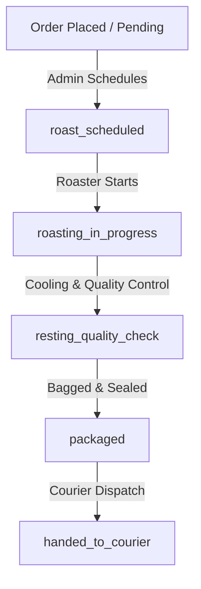

# Rerendet Farm — Admin & Operations Manual
**Audience:** Farm Owner & Operations Team  
**Scope:** Store settings, master controls, roasting substages, inventory, ticket SLA resolution, and security alerts.

---

## Table of Contents
1. [Logging In & Administrative Security](#1-logging-in--administrative-security)
2. [Daily Operations & Settings Configuration](#2-daily-operations--settings-configuration)
3. [Master Operational Controls (Killswitches & Caps)](#3-master-operational-controls-killswitches--caps)
4. [Roast Substages & Lifecycle Management](#4-roast-substages--lifecycle-management)
5. [Inventory & Stock Recalibration](#5-inventory--stock-recalibration)
6. [Support Ticket Resolution & SLA Deadlines](#6-support-ticket-resolution--sla-deadlines)
7. [Security Alerts & System Health Telemetry](#7-security-alerts--system-health-telemetry)

---

## 1. Logging In & Administrative Security

Access to the administrative interface is restricted to authorized personnel. The security architecture enforces strict protection layers:

*   **Role-Based Access Control (RBAC):** Only users with the roles `admin`, `super-admin`, `super_admin`, or `owner` can access backend admin routes.
*   **Authentication Mechanism:** Logins are verified using credentials hashed with `bcrypt` (work factor: 12) or MFA if enabled.
*   **Session Lifespans:**
    *   **Access Token:** Short-lived JSON Web Token (JWT) expiring in 15 minutes.
    *   **Refresh Token:** Long-lived secure cookie expiring in 7 days (or configured via settings up to 24 hours for active sessions).
    *   **Session Cookies:** Configured with `HttpOnly` (prevents script access), `Secure` (HTTPS only), and `SameSite=Strict` (prevents CSRF).
*   **Failed Logins:** Restricts attempts to 5 failures per IP/username per 15 minutes. After 10 consecutive failed attempts, accounts are locked for 30 minutes, and security logs generate an `AdminAlert`.

---

## 2. Daily Operations & Settings Configuration

The admin interface allows dynamic configuration of store information, shipping rates, and email settings. These parameters map directly to the `Settings` schema.

### A. Store & SEO Details
*   **Store Profile:** Configure Name (`Rerendet Coffee`), Contact Email (`info@rerendetcoffee.com`), Contact Phone (`+254700000000`), and Physical Address (defaulted to `Bomet, Kenya`).
*   **About Us Section:** Dynamically edit farm metadata, including Years in Business, Organic Percentage, Awards Won, and narrative stories explaining the Kalenjin origins of "Rerendet".
*   **SEO Parameters:** Optimize pages via custom Meta Titles, Descriptions (max 170 characters), Keywords, Google Analytics (GA4) Measurement IDs, and Facebook Pixel IDs.

### B. Shipping & Regional Rates
The system enforces county-level shipping rates and predefined region speeds:
1.  **County Shipping Matrix:** Lists all 47 counties of Kenya (e.g., Nairobi, Kericho, Bomet) mapped to standard rates (default: KSh 500).
2.  **Custom Delivery Rates:** Preconfigured options shown during checkout:
    *   `Nairobi Same-Day`: KSh 150 (Estimated delivery: 1 day)
    *   `Kiambu Next-Day`: KSh 200 (Estimated delivery: 1 day)
    *   `Mombasa Courier`: KSh 400 (Estimated delivery: 3 days)
    *   `Kisumu Courier`: KSh 400 (Estimated delivery: 3 days)
    *   `Other Regions Courier`: KSh 500 (Estimated delivery: 5 days)
3.  **Free Shipping Threshold:** Set a checkout limit (e.g., KSh 5,000) above which standard shipping fees are automatically waived.

---

## 3. Master Operational Controls (Killswitches & Caps)

In high-volume scenarios, during equipment maintenance, or under payment service outages, admins can alter behavior via the **Operational Controls** panel (`OperationalControls` model):

*   **Orders Master Toggle (`ordersEnabled`):** Turning this off stops all checkouts.
*   **Payment-Specific Killswitches:** Disables individual payment methods dynamically:
    *   `mpesaEnabled`: Toggles M-Pesa STK Push checkouts.
    *   `cashOnDeliveryEnabled`: Toggles Cash-on-Delivery (COD) checkouts.
*   **Hourly Order Cap (`hourlyOrderCap`):** Restricts the number of orders accepted per hour (e.g., 20 orders/hour to match roasting capacity).
*   **Category Overrides:** Disable ordering for specific categories (e.g., disable "Coffee Beans" while keeping "Brewing Accessories" active).
*   **Activation Reason (`activationReason`):** **Mandatory field.** If any master or payment toggle is disabled, the admin must provide a reason (e.g., *"M-Pesa API downtime from Safaricom"* or *"Roaster maintenance"*).

---

## 4. Roast Substages & Lifecycle Management

Because Rerendet Coffee is freshly roasted to order, orders transition through granular stages. Admins update the `roastStage` field of open orders via the Order Management dashboard (`PUT /api/orders/:id/roast-stage`):

### Roast Stage Descriptions
1.  **`null` (No Stage):** Default state for newly created orders or non-roast items (e.g., equipment).
2.  **`roast_scheduled`:** The order is batch-grouped and scheduled on the roasting calendar.
3.  **`roasting_in_progress`:** Beans are loaded into the drum. *Note: Once roasting begins, orders cannot be cancelled by customers without a KSh 200 fee.*
4.  **`resting_quality_check`:** Roasted beans are cooling, degassing, and undergoing color/aroma validation.
5.  **`packaged`:** Coffee is packaged in branded degassing-valve pouches, labeled with the origin, roast level, and roast date.
6.  **`handed_to_courier`:** Package is signed over to the logistics partner. The order status updates to `shipped`.

---

## 5. Inventory & Stock Recalibration

Stock tracking relies on three numerical variables inside each product's `inventory` block:

$$\text{Available Stock} = \text{Physical Stock} - \text{Reserved Stock}$$

### A. Inventory Field Reference
*   **Physical Stock (`inventory.physicalStock`):** Total physical inventory on shelves or raw green beans available.
*   **Reserved Stock (`inventory.reservedStock`):** Stock allocated to unpaid checkouts. To prevent stock hoards, checkout reservations automatically expire via database TTL indexes after **30 minutes**.
*   **Low Stock Threshold (`inventory.lowStockThreshold`):** The trigger level (default: 5 units). If Available Stock falls at or below this value, the product is flagged.

### B. Auto-Recalibration & Stock Operations
*   **Availability Guard:** The system rejects purchases exceeding `availableStock`.
*   **Auto-In-Stock Flag:** Whenever physical stock updates, `inStock` is automatically set to `true` (if available stock > 0) or `false` (if available stock <= 0).
*   **Cancellation Reversion:** If an order is cancelled or expires unpaid, the system replenishes inventory automatically by decrementing the `reservedStock` variable.

---

## 6. Support Ticket Resolution & SLA Deadlines

Customer inquiries and complaints generate tickets within the `Contact` model.

### A. Ticket Status Lifecycle
*   `new`: Ticket created by user, awaiting triage.
*   `pending` / `in_progress`: Opened by support and under active investigation.
*   `replied`: Admin has submitted an explanation or question to the customer (`adminResponse` field populated).
*   `resolved` / `closed`: Case concluded, issue addressed.

### B. SLA Audits & Breaches
*   **Linked Orders:** Tickets can link to order IDs (`linkedOrderId` and `linkedOrderSnapshot`) to give agents contextual checkout history.
*   **SLA Deadline (`slaDeadline`):** Set automatically upon ticket creation.
*   **SLA Breach Flag (`slaBreached`):** If a ticket is not resolved within the SLA timeline, the system marks `slaBreached: true` and logs a **warning** admin alert.
*   **SLA Resolution Rules:** First reply timestamps are saved in `firstAdminReplyAt`, and final resolutions are recorded in `respondedAt`.

---

## 7. Security Alerts & System Health Telemetry

System status is monitored continuously. Admins must address alerts displayed in the **Admin Alert Center**.

### A. Admin Alert Matrix
All alerts (`AdminAlert` model) are categorized by urgency:

| Alert Type | Category | Cause / Description | System Action |
| :--- | :--- | :--- | :--- |
| **Critical** | `failed_payment` | M-Pesa or Card transaction failed repeatedly. | Dashboard log + immediate email alerts |
| **Critical** | `dlq_item` | Dead Letter Queue items or worker process failures. | Dashboard log + immediate email alerts |
| **Critical** | `killswitch_event` | A master toggle (e.g., disabling M-Pesa/COD) is triggered. | Dashboard log + immediate email alerts |
| **Warning** | `sla_breach` | Support ticket exceeded response timeline. | Dashboard log |
| **Warning** | `low_stock` | Available stock has fallen below the threshold. | Dashboard log |
| **Info** | `new_order` | A new customer order is placed. | Dashboard log |
| **Info** | `new_user` | A new customer registers on the portal. | Dashboard log |

> [!IMPORTANT]
> **Critical Email Dispatch:** When a `critical` alert is written, the system automatically triggers a BullMQ job (`emailQueue`) via Redis. This immediately emails the alert body to all active, non-suspended administrative users.

### B. System Health Telemetry
Navigate to the **System Health** panel on the admin dashboard to inspect:
*   **System Health Endpoint (`GET /api/admin/system-health`):** Authenticated check displaying:
    *   *Service Latencies:* Latency trends for MongoDB, Redis, and queues.
    *   *Queue Counts:* Active, waiting, completed, and failed jobs.
    *   *Uptime Percent:* 24-hour uptime metrics.
    *   *Security Audits:* Database logs of recent logins and blocked requests.
